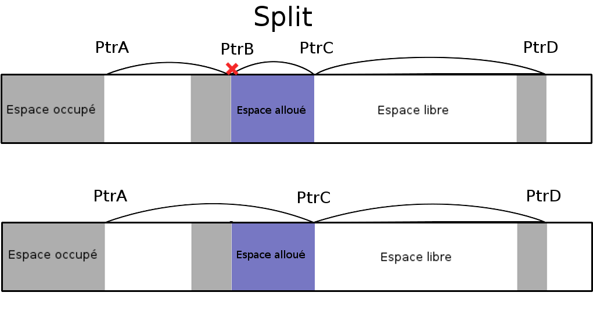

---
title: Rapport -- TP 2
author:
    - Abdelhakim Qbaich
    - David Boivin 
date: \today
header-includes:
    - \usepackage[french]{babel}
...

# Notre expérience

## Description du travail

Nous avions à implémenter une réplique approximative de la fonction
`malloc` de la librarie standard du langage de programmation `C`. Ce
travail nous a permis d'en apprendre plus sur le fonctionnement de la
gestion de mémoire. À partir de la fonction `mmap` nous avons créé des
fonctions qui vont permettent aux utilisateurs d'allouer de la mémoire
pour leurs données et de libérer la mémoire efficacement. Tout au long
de ce rapport, nous allons décrire l'implémentations , les algorithmes
que nous avons choisi et la façon dont nous avons décidé de
travailler.

##  Difficultés rencontrées

Les difficultés que nous avons rencontrés durant le travail sont les
suivantes. La première était de comprendre comment l'appel de `mmap`
fonctionnait dans le contexte que nous voulions l'utiliser pour le
travail. Il nous fallait aussi trouver les bon `flags`. Nous l'avions
trouvé avant que la solution soit divulguée sur studium. La prochaine
difficulté concernait la façon dont nous faisions notre liste
chainée. Après avoir implémenté correctement notre malloc nous avons
décidé qu'à la place de parcourir tous les éléments pour trouver une
place libre, on pouvait seulement parcourir les éléments que nous
savions qu'ils sont libres. Ainsi il fallait modifier notre liste
chainée.  La dernière difficulté fut l'implémentation d'un `merge`et
d'un `split`. La manipulation de la liste chainée avec les pointeurs
rendaient ce point plus difficile , surtout que notre liste est
simplement chainée. Ainsi il faillait qu'on regarde si les adresses
mémoires des `block` que l'on voulait `merge` étaient contigu en
mémoire. Pour le `split` l'opération était similaire. Biensûr il
fallait changer la grandeur de nos `block` à la suite de ces
opérations.  Malheureuseument nous n'avons pas pu faire le `merge`
puisque celui-ci n'était pas bien implémenté. Notre première
implémentation de `merge` comparait les adresses et le mettait dans la
bonne place , mais cela ne fonctionnait pas très bien. Donc nous avons
réglé temporairement en l'ajoutant au début de la liste chainée. Donc
il nous resterait à implémenter cette fonctionnalité correctement.

## La logique derrière nos implémentations

Quand nous avons implémenté notre travail notre première priorité fut
que nos fonctions fonctionnent avec les tests unitaires. Donc à ce
stade la fonction `mymalloc`et `myfree` fonctionnaient
correctement. Il suffisait seulement de paufiner notre travail en le
rendant plus rapide et plus efficace en transformant notre code pour
qu'il soient le plus élégant et lisible possible. Pour les algorithmes
et la fonçon dont notre code fonction il suffit de voir la section
documentation de ce rapport.

## Appréciation générale

Ce travail fut un bon défi pour notre apprentissage. Il nous a permis
de mieux comprendre comment on peut implémenter la gestion de mémoire
dans un langage de programmation. Il nous à aussi bien fait pratiquer
l'arithmetique des pointeurs et la structure de donnée de la liste
chainée. Ceci va nous être utile pour le reste de notre carrière en
informatique puisque c'est un éléments importants et présent dans
chaque langages de programmation. À la fin de ce travail nous étions
contents d'avoir bien réussi cette implémentation de `malloc`. 

# Documentation

## Notre implémentation

Pour l'implémentation de notre `malloc` et `free` nous avons utilisé
une structure `block` contenant une liste chainée, la taille du
`block` et un pointeurs pour les `data` du programme qu'il
l'utilisera. Cependant notre liste chainée ne contiendra pas les
éléments qui sont utilisés , mais plutôt les `block` qui sont libres
puisque ils sont les seuls qu'on doit parcourir pour allouer de la
mémoire. 


Nous avons aussi fait une fonction `extend` qui s'occupe d'allouer la
mémoire et de retourner cette plage à `malloc`. Nous allouons 4 Ko de
mémoire pour éviter au maximum de faire des appels à `mmap`. C'est
aussi le minimum que l'on peut alouer avec `mmap`. Nous avons essayer
d'allouer moins que cela , mais `mmap` utilisait quand même 4 Ko.

## La fonction `malloc`

Cette fonction sert à allouer de l'espace, mais aussi à réutiliser les
block qui ont été libérer auparavant. Elle prend comme argument la
taille de l'espace mémoire que nous voulons.  Pour ce faire nous
utilisons notre liste chainée. Puisque que tous les plages mémoires de
cette liste sont libres alors il suffit de regarder si leurs tailles
sont plus petites que celui de l'élément qu'on désire allouer. Si
c'est le cas on peut alors allouer cet espace avec `extend`. Ensuite
quand nous avons notre `block` mémoire il suffit de retourner le
pointeur vers les données. Biensur si on ne trouve pas de `block` de
mémoires alors on alloue un `block` de 4 Ko qui aura comme premier
élément l'élément demandé et le reste sera un `block` libre pour de
nouvelle allocation. Quand l'éléments sera alloué à un `block` libre
plus grand que l'espace demandé alors on effectuera un `split`. Le
`block` sera alors diviser selon la taille demandé. Il faut ensuite
simplement enlever le `block` que nous venons d'allouer de la liste
chainée et d'ajuster la taille du `block` libre restant.



## La fonction `free`

La fonction `free` va effectuer le travail de réarranger la liste
chainée et d'ajouter les éléments à cette liste. La fonction `free`
prend en paramètre un pointeur. Ce pointeur est l'emplacement mémoire
que l'on veut libérer. Au fur et à mesure que les éléments se
libéront, `free` rajoutera les éléments à la liste chainée. Il les
rajoutera de façon à optimiser les appels à `merge`. Pour ce faire on
rajoute les `block` en ordre croissant d'adresse. Ainsi il suffira de
comparer les adresses des éléments deux à deux et d'effectuer un
`merge` si les adresses sont contigues. Si la liste d'éléments libres
est vide alors on met le nouvel emplacement libre au début . Sinon on
parcours chaque éléments de la liste pour trouver où le mettre selon
l'ordre à laquelle sont placé les éléments en mémoire. 

La logique pour le merge est la suivante mais malheureusement nous
n'avons pas eut le temps de bien l'implémenter. Pour `merge` les
éléments il faut simplement prendre deux `block` libres et additionner
leurs tailles et mettre seulement un pointeur au début de celui-ci. Le
pointeur consiste à celui que l'on fourni à `free` en paramètre.


## Notre algorithme

Notre algoritme consite à effectuer le moins d'opération pour trouver
la mémoire et de réutiliser le plus de mémoire possible pour que notre
`malloc` soit efficace. Premierement nous avons utilisé une liste
chainée simple pour entreposer les informations concernant les `block`
mémoires. Cette liste sera la seule structure de données que nous
utiliseront pour implémenter notre `malloc`.  Notre liste contient
seulement des `block` libre , donc quand nous effectuons un recherche
pour un emplacement susceptible de convenir à notre `malloc`, nous ne
sommes pas obligé de passer sur tous les éléments déjà alloués. Pour
optimiser la mémoire , les fonctions `merge` et `split` servent à
manipuler les `block` mémoires pour optimiser la réutilisation de
`block`. Puisque `free` place les éléments en ordre croissant
d'adresse, nous pouvons alors comparer ces éléments deux à deux et
effectuer un `merge`. Pour perde le moins de mémoire possible il nous
a fallu implémenter un `split` qui prendra un `block` et le divisera
pour seulement contenir la mémoire nécessaire à l'utilisation. La
fonction `merge` est aussi implémenter pour permettre d'optimiser les
`block` mémoires.

### Force et faiblesse

Une force de notre algorithme est sa simplicité. Cela nous permet de
bien comprendre son fonctionnment et de facilement rajouter des
fonctionnalitées. Elle optimise aussi la réutilisation de mémoires
avec ses fonctions `merge` et `split`. Une des faiblesses est que
notre algorithme n'est pas le plus rapide et pourrait être optimisé
dans le parcours de la liste chainée.

### Alignement des adresses

Notre algorithme effectue un alignement mémoire. Elle ést éffectué par une macro situer en haut du fichier.

```
#define WORD_ALIGN(size) (((size) + (sizeof(size_t) - 1))
    & ~(sizeof(size_t) - 1))
```

Elle nous permet d'aligner les emplacements mémoires que nous allouons
quand on `èxtend` de 4 Ko notre mémoire.

### mmap 

La quantité de mémoire que l'on demande à `mmap`est 4 Ko puisque peu
importe si on lui demande moins de mémoires il nous fournira un page
de 4 Ko. Donc nous lui avons demandé le minimum. Si un utilisateur
demande plus de 5 Mo alors le programme lui retourne un pointeur
`NULL`. Ainsi il ne peut pas dépasser un certain maximum.

### free

Notre `free` peut prendre n'importe quel emplacement mémoire , mais si
il n'a jamais été alloué par `malloc` alors elle ne contient pas la
structure de données `block` au début de sa plage mémoire. Si cela
arrive alors `free` ne retourne rien. Il vérifie aussi que le pointeur
fourni à `free` n'est pas `NULL` sinon il retourne rien à son tour.

### Le code

Le code est structuré par deux fonction principal `malloc` et `free`
qui à leur tour appel plusieurs fonctions dans leur corps. La façon
dont on parcours la liste chainée est basique. Elle manque d'élégance
et pourrait être mieu optimisé. On utilise une indentation de la norme `GNU`.

### Les tests unitaires

Nous passons tous les tests unitaires même si certains sont plus long à
l'execution que d'autre.

### Cas mal géré

Dans la fonction `free` on regarde si le pointeur est ` > MMAP(0)` mais pas si il est plus petit que la premier `mmap`fait.


